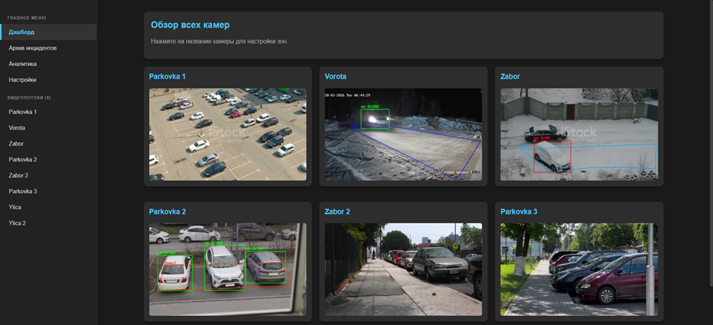
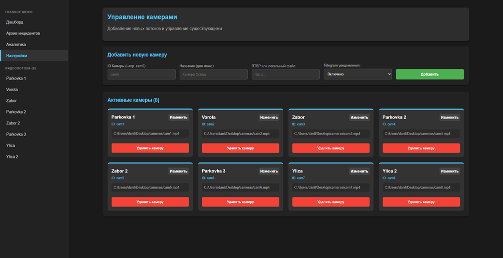
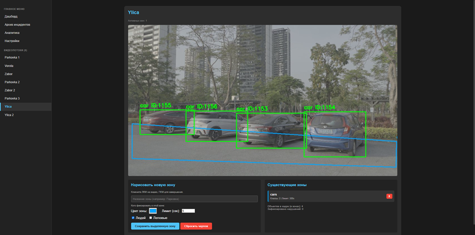
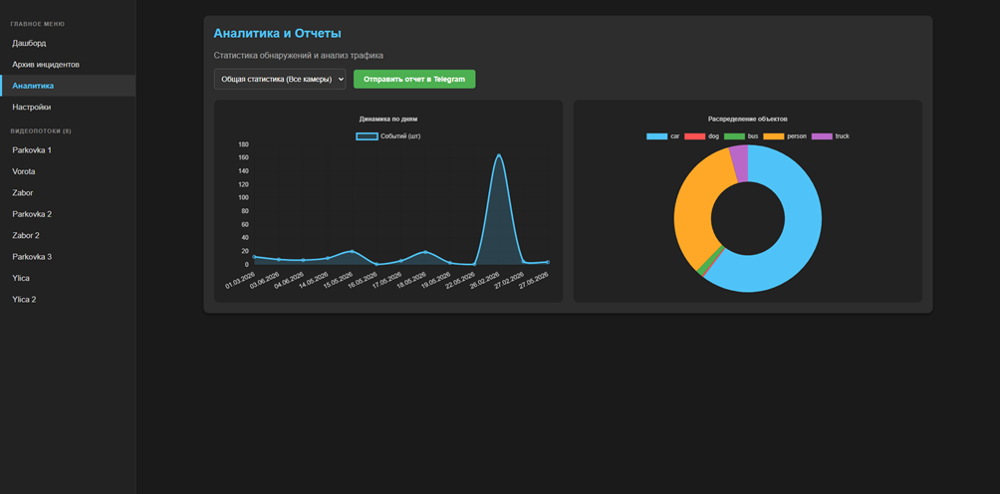

# Информационная система интеллектуального видеомониторинга

Система для автоматизированного видеонаблюдения, детекции объектов и контроля охранных геозон в режиме реального времени. 

Проект объединяет нейросетевую детекцию (YOLO), аппаратное ускорение видеокарт (TensorRT) и веб-интерфейс.

---

## Ключевые возможности
- **Многопоточный захват видео:** Поддержка множества IP-камер (RTSP) и локальных видеофайлов.
- **AI Видеоаналитика:** Детекция людей и транспорта с помощью YOLO в реальном времени.
- **Интерактивные геозоны:** Рисование числа независимых зон контроля прямо в браузере. Индивидуальные настройки цвета, времени фиксации и искомых классов для каждой зоны.
- **Высокая производительность:** Поддержка NVIDIA TensorRT (FP16), использование WebSockets для плавной трансляции десятка камер в интерфейсе без зависаний браузера.
- **Telegram Уведомления:** Асинхронная отправка фото нарушителей и аналитических отчетов в мессенджер через систему очередей.
- **Аналитика и Архив:** Сохранение истории инцидентов в СУБД SQLite, построение диаграмм с помощью Chart.js.

---

## Требования к системе
Для корректной работы системы с аппаратным ускорением требуется:
* **ОС:** Windows 10/11.
* **Python:** версия 3.10 или выше.
* **GPU:** Видеокарта NVIDIA с поддержкой CUDA (рекомендуется от RTX 2060 и выше).

---

## Установка и запуск

### 1. Клонирование и подготовка окружения
Склонируйте репозиторий и перейдите в папку проекта:
```bash
git clone https://github.com/your-username/name-repository.git
cd name-repository
```

Создайте и активируйте виртуальное окружение:
```bash
# Для Windows
python -m venv .venv
.venv\Scripts\activate
```

### 2. Установка зависимостей
Для быстрой установки всех необходимых библиотек используйте файл `requirements.txt`:
```bash
pip install -r requirements.txt
```

### 3. Оптимизация модели YOLO (Конвертация в TensorRT)
Для максимальной скорости (снижение нагрузки на процессор) необходимо конвертировать стандартную модель PyTorch `.pt` в аппаратно-зависимый формат `.engine`. 

Положите базовую модель (например, `yolo26s.pt`) в папку `models/` и выполните команду:
```bash
yolo export model=models/yolo26s.pt format=engine device=0 half=True
```
*В папке `models/` появится файл `yolo26s.engine`.*

Убедитесь, что в файле `config.py` указан правильный путь к скомпилированной модели:

```python
MODEL_PATH = "models/yolo26s.engine"
```

### 4. Настройка Telegram-бота
Создайте скрытый файл `.env` в корневой папке проекта и добавьте туда токены вашего бота (токен можно получить у [@BotFather](https://t.me/BotFather)):
```env
BOT_TOKEN=ваш_токен_бота
CHAT_ID=ваш_id_чата
```

### 5. Запуск системы
Запустите главный файл сервера:
```bash
python app_multi.py
```
После запуска откройте в браузере адрес: **http://127.0.0.1:5000**

---

## Руководство пользователя

### 1. Главная панель (Дашборд)
На главной странице отображается сетка всех подключенных камер. Трансляция ведется по протоколу WebSocket.



### 2. Добавление камер
Перейдите в раздел **«Настройки»**. 
1. Введите уникальный ID (например, `cam1`).
2. Укажите понятное название («Парковка»).
3. Вставьте RTSP-ссылку камеры или путь к локальному видеофайлу (`.mp4`).
4. Нажмите «Добавить». Камера появится в левом меню и начнет работу.



### 3. Настройка геозон и классов
Кликните на название камеры в левом меню. Вы перейдете в режим детальной настройки.
1. **Как рисовать:** Кликайте **левой кнопкой мыши** по видео, чтобы ставить углы зоны. Для завершения фигуры нажмите **правую кнопку мыши** (ПКМ).
2. Задайте имя зоны, выберите цвет и установите **лимит времени** (через сколько секунд нахождения объекта в зоне поднимется тревога).
3. Выберите галочками классы (Люди, Легковые авто и т.д.).
4. Нажмите «Сохранить выделенную зону».



### 4. Архив нарушений и Аналитика
Как только система фиксирует нарушение, инцидент записывается в базу данных SQLite, а скриншот с отрисованными рамками отправляется в Telegram.
* На вкладке **«Архив инцидентов»** доступен просмотр всей истории с возможностью фильтрации по дате, камере и типу нарушителя.
* На вкладке **«Аналитика»** система автоматически строит интерактивные графики. Кнопка «Отправить отчет» позволяет моментально сгенерировать графический файл и отправить его руководителю в Telegram.



---

## Структура проекта
```text
IVMS/
│
├── app_multi.py                  # Главный файл веб-сервера (Flask + SocketIO)
├── config.py                     # Глобальная конфигурация и загрузка .env
├── database.py                   # Логика работы с СУБД SQLite
├── telegram_bot.py               # Telegram-бот для уведомлений/управления
├── video_engine.py               # Ядро CV: захват видео, инференс YOLO, математика зон
├── polygons.json                 # (Legacy) Резервный файл сохранения полигонов
├── vidmon_sys.db                 # SQLite база данных системы
├── requirements.txt              # Зависимости Python
├── README.md                     # Руководством пользователя (документация)
├── images/                       # Папка со скриншотами для док-ии               
│
├── models/                       # Папка с AI-моделями
│   ├── yolo26s.engine            # Скомпилированный движок TensorRT
│   ├── yolo26s.onnx
│   └── yolo26s.pt                # Обученная модель YOLO
│
├── static/                       # Статические файлы фронтенда
│   ├── css/
│   │   └── style.css             # Основные стили интерфейса
│   └── violations/               # Скриншоты найденных нарушений (/jpg)
│
└── templates/                    # HTML-шаблоны Flask/Jinja2
    ├── base.html                 # Главная страница системы
    ├── dashboard.html            # Главная панель мониторинга со всеми камерами
    ├── analytics.html            # Страница аналитики
    ├── camera.html               # Просмотр конкретной камеры
    ├── screenshots.html          # Галерея архива с фильтрацией
    ├── settings.html             # Конфигуратор видеопотоков
    └── index_simple.html         # Упрощённая главная страница
```

---
*Проект разработан в рамках выпускной квалификационной работы.*